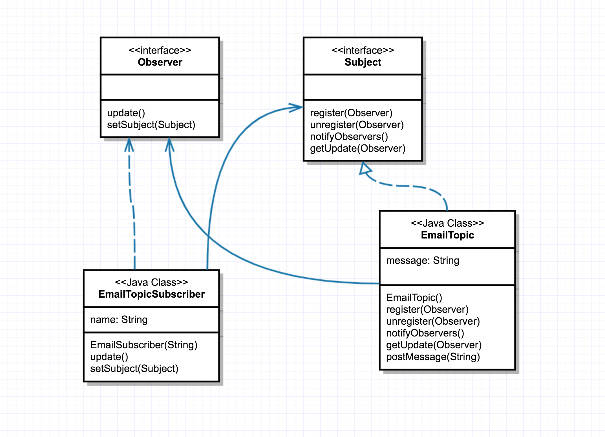

# Observer

O Observer é um padrão de projeto comportamental que permite que você defina um mecanismo de assinatura para notificar múltiplos objetos sobre quaisquer eventos que aconteçam com o objeto que eles estão observando. 

Portanto, utilize o padrão Observer quando mudanças no estado de um objeto podem precisar mudar outros objetos, e o atual conjunto de objetos é desconhecido de antemão ou muda dinamicamente.

Ao executar a aplicação example-1 dentro deste diretório, será possível observar o funcionamento desse pattern. 

**Output:**

```
FirstObserver - No new message on this topic!
Message posted to my topic: Hello subscribers!
FirstObserver - Retrieving message: Hello subscribers!
SecondObserver - Retrieving message: Hello subscribers!
ThirdObserver - Retrieving message: Hello subscribers!
Message posted to my topic: Hello again!
SecondObserver - Retrieving message: Hello again!
ThirdObserver - Retrieving message: Hello again!
```

**Diagrama desta aplicação:**

