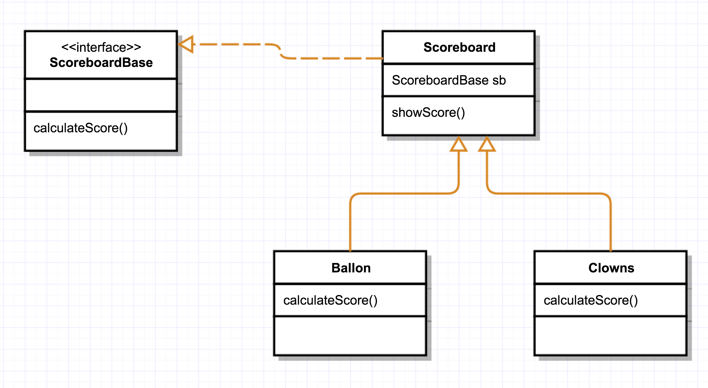

# Strategy

O Strategy é um padrão de projeto comportamental que permite que você defina uma família de algoritmos, coloque-os em classes separadas, e faça os objetos deles intercambiáveis.

Portanto, utilize o padrão Strategy quando você quer usar diferentes variantes de um algoritmo dentro de um objeto e ser capaz de trocar de um algoritmo para outro durante a execução.

Ao executar a aplicação example-1 ou example-2 dentro deste diretório, será possível observar o funcionamento desse pattern. 

**Diagrama da aplicação example-1:**

